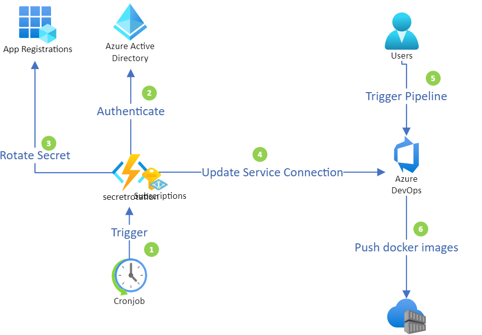

#  Service Principal Secret Rotation 
The code base contains a solution for rotating Service Principal secrets in Azure Active Directory, and automatically updating the Azure DevOps service connection with the newly created secrets, thereby ensuring that the Azure DevOps service connection is always up-to-date.


## Introduction
In order to maintain some level of security for the Service Principals (SPs) with secrets, it is advisable to rotate them periodically, in order to minimize potential unauthorized access by unscrupulous companies or individuals.
The good news is It's pretty easy to rotate SP secrets in Azure Active Directory. An authorized Administrator could use the following PowerShell or even Az CLI to rotate secrets manually from their computer.

**Az CLI**
```powershell
 az ad sp credential reset --name "myspn" --end-date 2021-11-15
```  
**PowerShell**
```powershell
 Remove-AzADAppCredential -ApplicationId 11111111-2222-3333-4444-00000000
 $veryhardpassword = ConvertTo-SecureString -String "mypassword123321654_" -AsPlainText -Force
 New-AzADAppCredential -ApplicationId 11111111-2222-3333-4444-00000000  -Password $veryhardpassword -EndDate 2021-11-15
```  
When you add Azure DevOps into the mix, the process becomes a little more challenging. A service connection with an SP associated to it would not be automatically updated by rotating the SP secret in Azure AD, so the Administrator would have to manually update the Azure DevOps service connection, and verify that the pipeline are working.

This code base concentrates on trying to alleviate Administrators from manual intervention and human errors which is unfortunately inevitable, by applying an automatic approach for rotating SP's secrets and updating Azure DevOps service connection, by using PowerShell script on Azure Function, the script will be run as a cron job, and will rotate the SPN secret every 5 hours and update Azure DevOps service connection. 

## Solution
 In this example we are using Azure Container Registry for testing purposes. You can of course use other service connection types such as **Azure Resource Manager**  using Service Principal authentication.



 1. **Cronjob:** 
     Azure function is setup with a time trigger which enables the function to be executed on a schedule, in this
     case the time trigger is set to run every 5 hours. 
     
 2. **Azure function with Managed Identity:**
        Azure function is configured with a Managed Service Identity (MSI) in Azure AD. The identity is
        tied to the Azure function, so if one would to delete the Azure function, the MSI will be
        automatically removed from Azure AD tenant. The major advantage in this case with MSI are
        we don't need to rotate the secret for MSI, and yes MSI is just like any other app registration except the
        secrets are stored securely and managed by Azure.  The MSI need to have sufficient permission to rotate 
        secrets, this can be achieved by assigning Azure AD role Application Administrator to the MSI. Once the time 
        trigger initiates Azure function,  the code will authenticate against Azure Active Directory as MSI.

> **_! Note:_**
The MSI will be removed when you delete your application, only if you have specified identity type **system-assigned identity**.

 3. **Rotate Secrets:**
        Once authenticated and authorized, the function will search for the target service principal associated with
        Azure DevOps service connection and remove the existing secret. Generate a new random secret of a
        minimum length of 32 to 47 bytes for target service principal. 
     
 > **_! Note:_**
In the code, you can adjust the length of the secret up to 254 bytes.

 4. **Update Service Connection:**
        Once the secret has been rotated for the target service principal, the function will construct an API rest call to
        update the service connection.
 
 5. **Trigger pipeline:**
        Commonly this is done by a git commit followed by a git push, this will trigger the pipeline to initiate the
        building of the application.
     
 6.  **Push Docker Images:**
        Following completion of the build, Azure DevOps will be able to push docker images with its newly generated 
        service principal secrets to its target, building docker images, which are pushed to Azure Container Registry.

## Procedure
### 1. Create Azure DevOps Service Principal
Login to **Azure Portal** --> Click  on **Portal menu** --> from the menu click **Azure Active Directory** --> under manage click **App registrations** --> **+ New registration** --> provide a name call it **spnrotator** --> Click on the **Register button**, to create the service principal. --> generate a temporary secret, by clicking **Certificates & secrets** under Manage for the service principal --> click on **+ New client secret** --> Enter a Description, call it **secret rotation** and click **Add**

> **_! Note:_**
Note down the **Application ID** , **Object ID**.

### 2. Create Azure Container Registry
Follow the Microsoft docs to deploy Azure Container Registry (ACR): https://docs.microsoft.com/sv-se/azure/container-registry/container-registry-get-started-portal

Once deployed, we need to provide permissions for spnrotator service principal to push images to ACR.
From your ACR overview blade, click **Access control (IAM)**  --> click **+ Add** --> from the drop down menu choose **Add role assignment** --> from the list choose **acrPush** --> click **Next** --> **+ Select members** --> search for spnrotator --> select **spnrotator** ->  and press the button **Select** --> select **Review + assign**.

> **_! Note:_**
Note down the URL for yor ACR. 

### 3. Create Azure DevOps Pipeline and Service Connection
Follow the Microsoft docs to configure pipeline to push docker images to ACR. https://docs.microsoft.com/en-us/azure/devops/pipelines/ecosystems/containers/acr-template?view=azure-devops. When configuring service connection use the registry type **Others**  fill the different fields as indicated below:

 **Docker Registry:** The URL of your ACR
 **Docker ID:** service principal application id
 **Docker Password:** "ThisPasswordWillNotWork_123"

You will also need to generate a Personal Access Token (PAT) from Azure Devops, ensure you note down the PAT as it will be used in a later stage. procedure for generating PAT, can be found here: https://docs.microsoft.com/en-us/azure/devops/organizations/accounts/use-personal-access-tokens-to-authenticate?view=azure-devops&tabs=preview-page#create-a-pat

> **_! Note:_**
Note that we are deliberately adding a fake password to service connection, as we want to validate that it will work later with Azure function. 

Run your build pipeline, it should at this stage fail at Push stage, and you should expect following error message or similar "**No valid permissions**"

### 4. Create Azure Function
Create an Azure function with a time trigger according to Microsoft documentation:
https://docs.microsoft.com/en-us/azure/azure-functions/functions-create-scheduled-function
ensure the runtime stack is set to **PowerShell**.
you can simply take the run.ps1 code an paste it in the Azure function code editor.
or deploy Azure function with the whole code base provided in the repository.
ensure you fill in the following variables in **run.ps1** file.

**run.ps1**
```powershell
$OrganizationName =  "<NAME OF AZDO ORG NAME>"

$ProjectName =  "<YOUR PROJECT NAME>"

$PAT =  "<AZDO PERSONAL ACCESS TOKEN>"

$Serviceconnectionname =  "<NAME OF AZDO SERVICE CONNECTION NAME>"

$AcrUrl =  "<URL of ACR>"
```  

Once everything is deployed and the azure function has started, run your pipeline again and  you should know be able to deploy to push images to ACR successfully. 

### 5. Security considerations
 - Ensure you do not store the PAT in your repository, recommendation is to use Azure KeyVault 
 - Application Administrator role for MSI, consider to use Azure AD custom role, to provide as little privilege as
   possible for MSI, again its whole purpose is to list specific Service principals, remove and add new secrets. 
   more information about custom roles in Azure AD can be found here: https://docs.microsoft.com/en-us/azure/active-directory/roles/custom-create
- Restrict Access to Azure Functions, Function is a public service provided by Azure, consider to restrict access or simply block all access from internet apart from Azure cloud and Azure Active directory. more information about service tags is here: https://docs.microsoft.com/en-us/azure/virtual-network/service-tags-overview restrictions possibilities in Azure function.

### 6. Credits
 A Massive thanks to
  - **Moim Hossain**, for his guidelines
  - **Peter Lithner** for his support